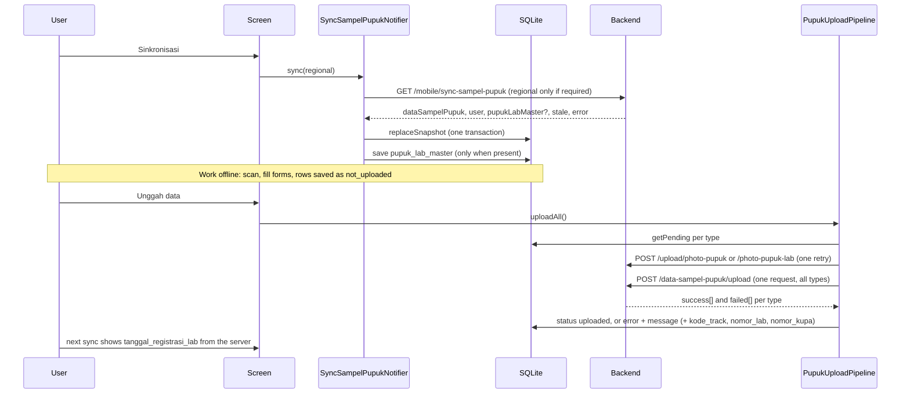

# Data layer

How the app stores data on the device, talks to the backend, and moves rows
between the two. Screens read this layer only through Riverpod providers.

## Layers

```
screens and widgets
        |  ref.read / ref.watch
providers (features/*/providers, core/*/*_providers.dart)
        |
DAOs (core/database/daos, features/pupuk_lab/data)      API classes (core/network/api)
        |                                                      |
AppDatabase (sqflite) + migrations                      Dio (ApiClient: fallback, auth, logging interceptors)
```

- `AppDatabase` (`core/database/app_database.dart`) opens the file, applies
  `kMigrations` and nothing else. It holds no queries.
- DAOs hold the queries of one aggregate. They take the `AppDatabase`, never a
  `Database`, so the connection is opened lazily and once.
- API classes (`AuthApi`, `LsuApi`, `PupukApi`, `AreaApi`, `NotificationApi`,
  `UploadApi`) take the shared `Dio` and return `ApiResponse<T>`; they never
  throw for HTTP or transport errors (`ApiBase.handleError`).
- Providers wire these together. Overriding `appDatabaseProvider` and
  `dioProvider` is enough to test any feature against an in-memory database and
  a fake transport.

Decision: DAOs and APIs are plain classes behind providers, not singletons.
Reason: the old `DatabaseHelper.instance` and per-provider `ApiService(ApiClient().dio)`
could not be replaced in tests and hid the dependencies of every screen.

## Providers

| Provider | Type | File |
| --- | --- | --- |
| `appDatabaseProvider` | `AppDatabase` | `core/database/database_providers.dart` |
| `lsuDaoProvider`, `dataSampelPupukDaoProvider`, `kirimDariEstateDaoProvider`, `kirimLabDaoProvider`, `kirimSertifikatEstateDaoProvider`, `preferencesDaoProvider` | DAOs | same |
| `pupukLabDaoProvider`, `pupukLabMasterDaoProvider`, `pupukLabMasterRepositoryProvider` | DAO / repository | `features/pupuk_lab/providers/pupuk_lab_providers.dart` |
| `pupukLabMasterProvider` | `FutureProvider<PupukLabMasterSnapshot?>` (master, `syncedAt`, `isStale`) | same |
| `reservedPupukLabKodeProvider` | `FutureProvider<Set<String>>`, invalidate after saving or deleting a receipt | same |
| `dioProvider`, `authApiProvider`, `lsuApiProvider`, `pupukApiProvider`, `areaApiProvider`, `notificationApiProvider`, `uploadApiProvider` | Dio and API classes | `core/network/api_providers.dart` |
| `regionalRequiredProvider` | `Provider<bool>`, false for Pupuk Lab only accounts | `features/regional/providers/regional_provider.dart` |
| `syncSampelPupukProvider`, `uploadSampelPupukProvider`, `pupukUploadPipelineProvider` | notifiers and pipeline | `features/pupuk/providers/` |

## DAOs

| DAO | Tables | Core operations |
| --- | --- | --- |
| `PreferencesDao` | `user_preferences` | `set`, `get`, `delete` |
| `LsuDao` | `master_sampel`, `master_lsu`, `received_sample`, `completed_sample` | master batch insert, clear, `getMasterLsuById`; `received` and `completed` are `StatusTable`s (below), plus `received.getUploaded()`, `getByDataLsuId` |
| `DataSampelPupukDao` | `data_sampel_pupuk` (reads `kirim_*`) | `replaceSnapshot(list, regional:)` (one transaction), `getAll({regional})` ordered by `kode_sampel`, `getById`, `getAktivitas(id, individualKodeSampel:)`, `getEligibleKirimSertifikat`, `updateTanggalKirimSertifikatEstate`, `resolveNoSurat` |
| `KirimDariEstateDao`, `KirimLabDao`, `KirimSertifikatEstateDao` | `kirim_dari_estate`, `kirim_lab`, `kirim_sertifikat_estate` | `StatusTable` + `getLatestForSample`; `KirimLabDao.latestNoSurat` |
| `PupukLabDao` | `pupuk_lab` | `StatusTable` + `updateDraft`, `markUploaded`, `getReservedKodeSampel({excludingId})` |
| `PupukLabMasterDao` | `pupuk_lab_master` | `save`, `load`, `clear` (single row, key `master`) |

`StatusTable<T>` is the shared shape of every row that waits for upload:
`insert` (the id is always assigned by SQLite), `getPending` (`status` in
`not_uploaded` or `error`, newest first), `getAll`, `getById`, `delete`,
`updateStatus(id, status, errorMessage:)`.

`getReservedKodeSampel` returns the codes of every local receipt, uploaded or
not. The contract says "pending", but an uploaded receipt is still invisible to
the device until the next sync stamps `tanggal_registrasi_lab`, so excluding it
too prevents offering the same sample twice.

## Migration policy

Schema lives in `core/database/migrations/`:

- `schema.dart`: the CREATE statements of the latest layout. A fresh install
  runs `Schema.createStatements` (`createDatabase`).
- `v2_tracking_column.dart`, `v3_pupuk_lab.dart`, `v4_pupuk_lab_error_retryable.dart`: one `Migration` per version.
  `kMigrations` lists them in order; `kDatabaseVersion` is the last version.
- `upgradeDatabase` runs every migration with `oldVersion < version <= newVersion`.
  sqflite wraps the upgrade in a transaction, so a failing step leaves the old
  version intact.

Rules:

1. Never edit a shipped migration. Never change `Schema` in a way an existing
   database cannot reach through migrations.
2. A migration reuses the constants of `Schema` for what it adds. A new table:
   add `Schema.myTable`, append it to `Schema.createStatements`, and
   `await db.execute(Schema.myTable)` in the migration. A new column on an old
   table: add it to a `Schema.<table>V4Columns` map, append it at the END of that
   table's CREATE statement (an `ALTER TABLE ADD COLUMN` lands at the end, and the
   test compares column order), and call `addColumnIfMissing` per entry.
3. Drop or rename with explicit SQL in the migration only; remove the table from
   `Schema`.
4. `test/core/database/migrations_test.dart` must stay green: it upgrades a frozen
   copy of the v2 schema (`test/helpers/legacy_schema_v2.dart`) and compares it
   with a fresh install (columns with position, foreign keys, indexes).

Adding v5 (the next one):

1. Add the table or column constants to `schema.dart` (rule 2).
2. Create `migrations/v5_<name>.dart` implementing `Migration` with `version => 5`.
3. Append `MigrationV5...()` to `kMigrations`. `kDatabaseVersion` follows.
4. Extend the migration test: seed a v4 database (create it from the v2 statements
   and run `upgradeDatabase(db, 2, 4)`), upgrade, and assert the schema equals a
   fresh install. `upgrade v3 to v4` in `migrations_test.dart` is the pattern.
5. Add the DAO methods and tests.

v4 added `pupuk_lab.error_retryable` (`INTEGER NOT NULL DEFAULT 1`). Existing receipts keep 1, so
they stay retryable.

v3 added `pupuk_lab`, `pupuk_lab_master`, `data_sampel_pupuk.registrasi_lab_by`,
`data_sampel_pupuk.pupuk_lab_terima_id`, and dropped `terima_dari_gudang` and
`terima_dari_estate` (no code read or wrote them; the `tanggal_terima_dari_*`
columns of `data_sampel_pupuk` are unrelated and stay).

Users who skipped v2 and upgrade from v1 end with `tracking_sampel_pupuk` after
`updated_at` instead of before it. The set of columns is the same, only the
position differs; no query depends on position.

## Offline-first sync and upload



Sync details (`SyncSampelPupukNotifier.sync`):

- A regional is required unless `requiresRegional(user)` is false, i.e. the user
  is Pupuk Lab only (`User.isPupukLabOnly`: lab permission and no LSU, estate,
  NT permission). Those users send no `regional`; the backend returns every
  regional and ignores the parameter.
- Users with the lab permission get a whole-table replacement, because their
  response includes other regionals; a regional-only clear would keep samples that
  were already received.
- `pupukLabMaster` is stored only when non-null. When it is null the previous
  master stays and is flagged stale (`pupukLabMasterStale`, `pupukLabMasterError`
  in the state). `PupukLabMasterRepository.isStale` is also true when the server
  said so or `fetchedAt` is older than 24 hours.
- The whole sync is one atomic table replacement; on any error local data is
  untouched.

Upload details (`PupukUploadPipeline.run`):

- Strategies run in this order: kirimDariEstate, kirimLab, kirimSertifikatEstate,
  pupukLab. Progress counts rows across all of them.
- Rows that share a local file upload it once (Kirim Lab: same no. surat and
  photo; Kirim Sertifikat: same PDF) and reuse the server path. A Terima Lab
  receipt uploads each of its up to 5 photos separately, `fotoPaths` keeps the
  order.
- Each file gets one retry after 400 ms. If it still fails, every row of the group
  is set to `error` ("Gagal mengunggah foto", or "Gagal mengunggah file
  sertifikat") and is left out of the payload.
- One request carries every type; all four keys are always present. When no item
  survived the photo step the request is skipped.
- `UploadSampelPupukState` exposes `lastSuccessCount`, `lastFailedCount` and
  `resultsByType[type]` (`uploaded`, `failures[]` with `id`, `label`, `message`,
  `retryable`).

## Error and retry matrix

| Situation | Local row | `retryable` in results | Next upload | User action |
| --- | --- | --- | --- | --- |
| Photo upload fails twice | `error`, "Gagal mengunggah foto" | true | sent again | none, or check connection |
| Whole upload request fails (offline, 5xx, 401 after refresh) | unchanged (`not_uploaded` or old `error`) | true for every row; `error` set on the state | sent again | none |
| Kirim types: server lists the row in `failed` | `error` + server message | true | sent again | fix the cause if the message says so |
| Terima Lab: server `failed`, `retryable: true` (SmartLab down, timeout) | `error` + message | true | sent again (same `clientUuid`) | none |
| Terima Lab: server `failed`, `retryable: false` (SmartLab 422, validation) | `error` + message, `error_retryable = 0` | false | skipped (photos too) until edited | edit via `PupukLabDao.updateDraft` (keeps `client_uuid`, resets to `not_uploaded` and `error_retryable = 1`) or delete |
| Terima Lab: server `success` with `duplicate: true` | `uploaded`, `kode_track`, `nomor_lab`, `nomor_kupa` saved | n/a | not sent | none |
| Terima Lab: sample already received, other noSurat, unknown sample | permanent failure (as above) | false | | remove the sample or delete the receipt |
| Sync: SmartLab master unreachable | old master kept | n/a | | `pupukLabMasterStale` shows a warning; forms stay usable |
| Sync: no master ever stored and SmartLab down | no master | n/a | | `pupukLabMasterError` shown; Terima Lab form cannot open |
| SQLite exception | exception text in `UploadSampelPupukState.error` | n/a | | none |

A Terima Lab receipt that failed for good keeps `error_retryable = 0`.
`PupukLabUploadStrategy.loadPending` leaves it out, so its photos are not sent
again. `PupukLabDao.getPending` still returns it, because the lists and the home
count must show it as needing attention (`PupukLab.needsEdit`). Use
`PupukLabDao.markFailed(id, message, retryable:)` to record a failure.

## Terima Lab data

- `PupukLab` (`pupuk_lab` row): `clientUuid` (uuid v4, created once, survives edits),
  `noSurat`, `samples` (`PupukLabSample`: `dataSampelPupukId` or manual), `form`
  (`PupukLabForm`), `fotoPaths` (local files), status columns, and the SmartLab
  result (`kodeTrack`, `nomorLab`, `nomorKupa`).
- `PupukLabForm.toJson()` is exactly the contract `PupukLabForm`; `form_json` is
  uploaded as stored. `PupukLabForm.validate(samples:, noSurat:, fotoCount:, master:)`
  mirrors the SmartLab rules (text lengths from the `track_sampel` columns, date
  order, parameter uniqueness and kode subset, options and progress ids against the
  master, sanitized code uniqueness). Errors are keyed by field (`estimasiKupa`,
  `parameters.1.kodeSampel`).
- `PupukLabMaster` helpers: `jenisById`, `progressOptionsFor(jenisId)` (jenis
  `progressIds` in order, named through `progressPengerjaan`), `parametersFor`,
  `parameterById`, `isOlderThan`. `PupukLabForm.defaultTanggalTerima(memo)` is the web
  rule (memo day, +1 day from 12:00).
- Eligibility: `isEligibleForPupukLab(data, individualKodeSampel:, pendingPupukLabKodes:)`
  is true when Kirim Lab is set (tracking tuple index 3, else `tanggalKirimLab`), Terima
  Lab is not (tuple index 4, else `tanggalRegistrasiLab`) and no local receipt holds the
  code. `allowedPupukActivityTypes(..., pendingPupukLabKodes:)` and
  `homePupukActivityTypes` include `kPupukLab` for users with the permission. Feed
  `pendingPupukLabKodes` from `ref.watch(reservedPupukLabKodeProvider)`.

## Adding an activity type

1. Constants: add `kMyType` and its label to `pupuk_activity_types.dart`, append it to
   `kUploadablePupukActivityTypes`, extend `allowedPupukActivityTypes` and
   `homePupukActivityTypes` with the new permission in `PermissionConstants`.
2. Table: add `Schema.myType`, a migration (see above), a model with `fromJson`/`toJson`,
   and a DAO extending `StatusTable<T>` (or `SampelActivityTable<T>` when the row links
   to `data_sampel_pupuk`).
3. Payload and response: add the item class in `pupuk_upload_models.dart`, add the type to
   `SampelPupukUploadResponse.fromJson`, and the backend key to the contract.
4. Strategy: extend `StatusTableUploadStrategy<T>` when the server answers with plain
   success/failed id lists and one file per group; otherwise extend
   `PupukUploadStrategy<T>` (see `PupukLabUploadStrategy`). Implement `loadPending`,
   `idOf`, `labelOf`, optionally `groupRows`, `localFiles`, `uploadFile`, `buildItem`,
   `markPhotoFailure`, `applyResult`.
5. Register the strategy in `pupukUploadPipelineProvider`, then add the DAO provider.
6. Tests: DAO queries, the strategy with `FakeUploadApi` (`test/helpers/fake_upload_api.dart`),
   and the eligibility matrix.

## Tests

`flutter test` runs everything. Database tests use `sqflite_common_ffi` through
`newTestDatabase()` (in memory) and never touch a device. Network behavior is faked by
extending `Fake implements UploadApi` / `PupukApi`; no HTTP is mocked.
